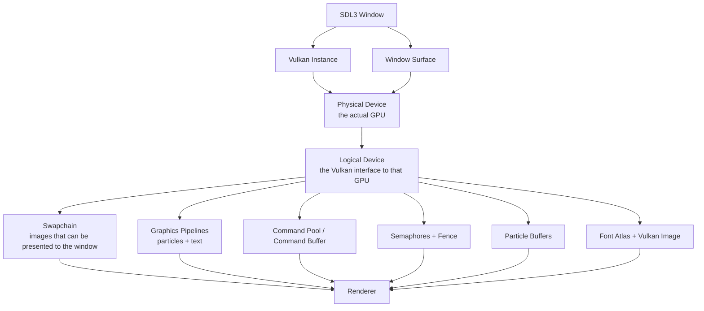
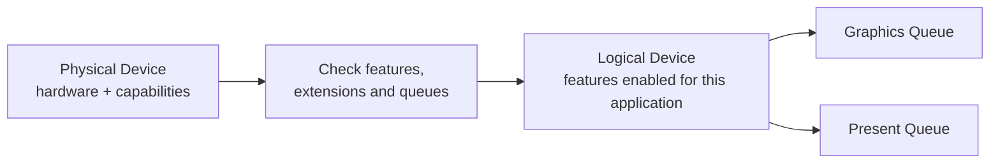
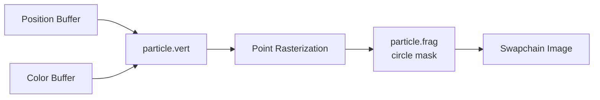
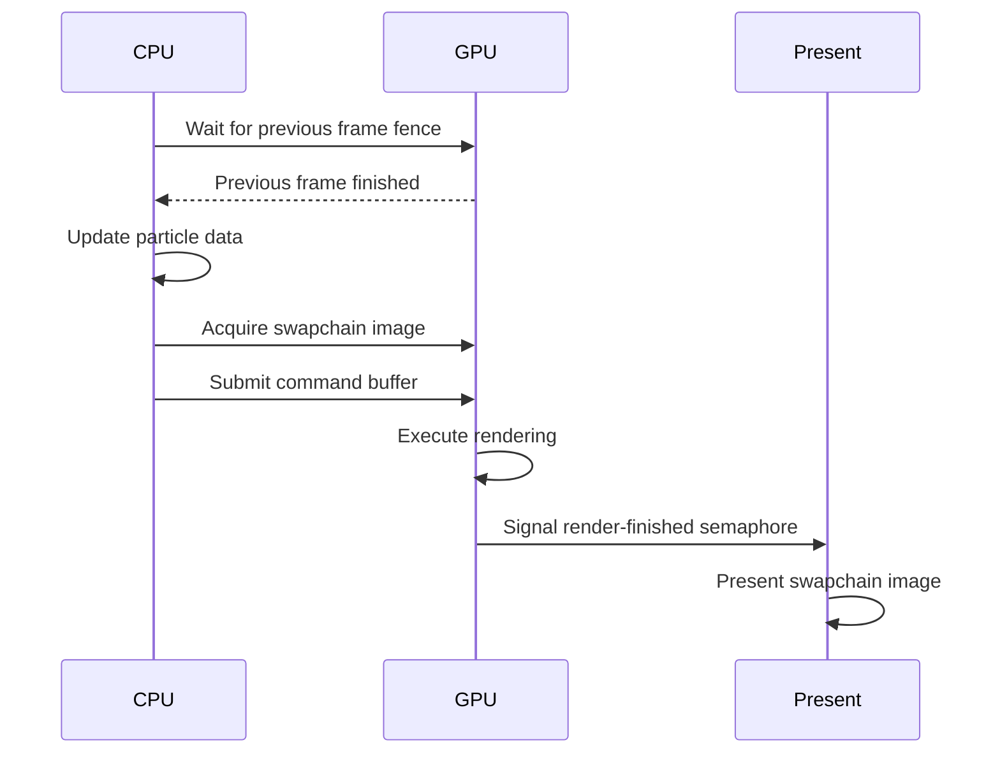
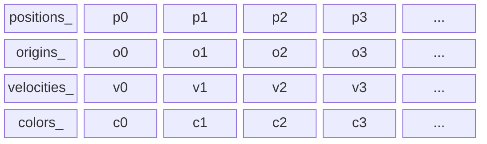
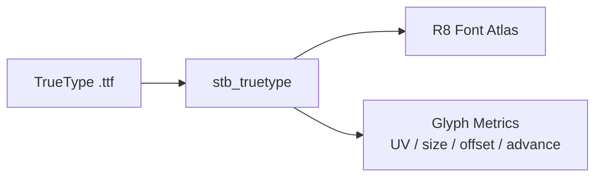
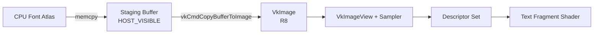
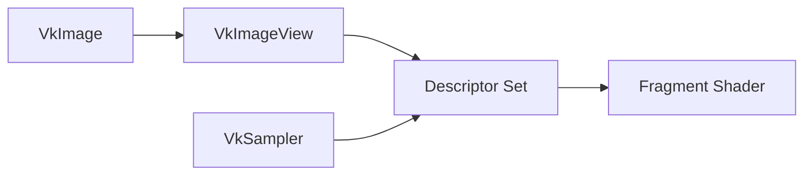
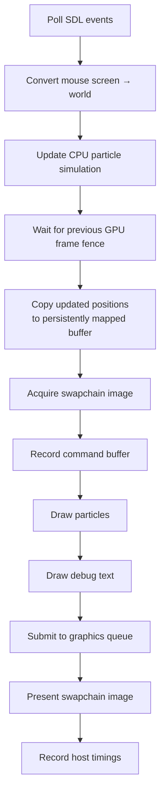

# Pixel Storm

Pixel Storm is a small 2D graphics project I built mainly to learn **Vulkan** by using it directly instead of hiding it behind a game engine.

The visible idea is simple: load an image, turn its visible pixels into particles, and let those particles react to the mouse while trying to return to their original positions.

---

## 1. The big picture

At startup, the program roughly builds the following stack:



One thing I wanted to understand clearly is that Vulkan does not give you a ready-made renderer. It gives you explicit pieces and asks you to connect them correctly.

---

# 2. Instance, physical device, and logical device

These three names sound similar, but they represent different levels.

## Vulkan Instance

The `VkInstance` is the application's entry point into Vulkan.

It tells Vulkan things such as:

- which Vulkan API version the application expects;
- which instance extensions are required;
- whether validation layers are enabled;
- which platform integration is needed.

SDL provides the extensions required to connect Vulkan to the native window system.

---

## Physical Device

A `VkPhysicalDevice` represents an actual GPU available to Vulkan.

The program does not simply choose the first GPU it finds. It checks that the device supports the things Pixel Storm actually needs:

- the required Vulkan API version;
- a graphics queue;
- a presentation queue;
- swapchain support;
- required Vulkan extensions;
- dynamic rendering;
- Synchronization 2;
- large point rendering;
- the shader features used by the project.

It also stores the GPU's memory properties, because later the program must choose appropriate memory types for buffers and images.

So the physical-device step is essentially:

> "Which GPU can actually run my renderer?"

---

## Logical Device

The `VkDevice` is the application's Vulkan connection to the selected physical device.



- **Physical device:** what the GPU *can* do.
- **Logical device:** what my application has explicitly enabled and will use.

---

# 3. The swapchain: getting an image onto the screen

Rendering somewhere in memory is not enough; the final image must be presented to the operating-system window.

That is the job of the **swapchain**.

The swapchain contains several presentable images. A frame renders into one of them, and that image is then presented to the window.

Pixel Storm:

1. asks the surface which formats and presentation modes are supported;
2. prefers an sRGB color format;
3. chooses the current drawable size;
4. creates the swapchain;
5. retrieves its images;
6. creates an image view for each swapchain image.


---

# 4. Graphics pipelines

A Vulkan graphics pipeline is a large description of how graphics data moves through the programmable and fixed-function graphics stages.

Pixel Storm currently has **two graphics pipelines**.

## Particle pipeline

The particle pipeline uses:

- `VK_PRIMITIVE_TOPOLOGY_POINT_LIST`;
- a position vertex stream;
- a color vertex stream;
- a particle vertex shader;
- a particle fragment shader;
- a camera matrix passed through push constants.

Each particle becomes one Vulkan point primitive.

The fragment shader uses `gl_PointCoord` to discard fragments outside a circle, so the particles appear as circles rather than square points.



---

## Text pipeline

The text overlay has different requirements:

- `VK_PRIMITIVE_TOPOLOGY_TRIANGLE_LIST`;
- text vertices containing position and UV coordinates;
- a font texture;
- a descriptor set;
- different vertex and fragment shaders.

`GraphicsPipeline` is configurable only for the parts that genuinely differ between the two but serves as a reusable base for common functionality.

That was an important design lesson for me:

> Do not generalize code before there are at least two real use cases proving what actually needs to vary.

---

# 5. Command buffers: recording work for the GPU

Vulkan graphics commands are not normally executed immediately when the C++ code calls them.

For a frame, that command buffer contains work such as:

- changing image layouts;
- beginning dynamic rendering;
- setting the viewport and scissor;
- binding the particle pipeline;
- binding particle vertex buffers;
- pushing the camera matrix;
- drawing the particles;
- binding the text pipeline;
- binding the font descriptor;
- drawing the text;
- ending rendering;
- transitioning the swapchain image for presentation.

The command buffer is then submitted to the graphics queue.

This model initially felt strange compared with higher-level APIs, but it now makes sense: I am building a packet of GPU work and then submitting it.

---

# 6. Synchronization: preventing the CPU and GPU from stepping on each other

CPU and GPU execution are asynchronous.

The CPU can prepare the next frame while the GPU is still working on the previous one, which means resource ownership and timing matter.

Pixel Storm currently keeps this simple with **one frame in flight**.

It uses:

- an **image-available semaphore**: tells graphics work that a swapchain image has been acquired;
- a **render-finished semaphore**: tells presentation that rendering has completed;
- a **fence**: lets the CPU wait until the previous submitted frame has finished.

The frame flow is approximately:



A very important lesson here is that **memory coherence is not the same thing as synchronization**.

Even if CPU-visible memory is coherent, Pixel Storm still cannot safely overwrite a buffer while the GPU is reading it. The fence is currently what makes the host-side write safe.

---

# 7. CPU simulation: an image becomes millions of particles

The input image is loaded on the CPU.

For every visible pixel (or every Nth pixel, depending on the `--gap` argument), the program creates particle data.

Each logical particle currently has four properties:

- current position;
- original position;
- velocity;
- color.

Originally stored them like this:

```cpp
struct Particle {
    glm::vec2 position;
    glm::vec2 origin;
    glm::vec2 velocity;
    glm::vec4 color;
};
```

That worked, but it accidentally made the CPU simulation structure become the Vulkan vertex format too.

The simulation needs:

- position;
- origin;
- velocity.

The graphics pipeline needs:

- position;
- color.

Those are different requirements.

---

# 8. AoS vs SoA: separating simulation data from rendering data

Particle representation to **Structure of Arrays (SoA)**:

```cpp
std::vector<glm::vec2> positions_;
std::vector<glm::vec2> origins_;
std::vector<glm::vec2> velocities_;
std::vector<glm::vec4> colors_;
```

Conceptually:



The renderer receives only what it needs.

There are two Vulkan vertex buffers:

- a **position buffer**, updated every frame;
- a **color buffer**, uploaded once because colors are currently static.

The vertex shader still sees:

```glsl
layout(location = 0) in vec2 position;
layout(location = 1) in vec4 color;
```

but Vulkan maps those shader locations to two different vertex-buffer bindings.

This distinction between **shader location** and **vertex-buffer binding**.

---

# 9. Persistent mapped memory

The particle positions are still simulated on the CPU, so every frame the updated positions must be written into memory visible to Vulkan.

1. `vkMapMemory`;
2. `memcpy`;
3. `vkUnmapMemory`.

Each frame is effectively just:

```cpp
std::memcpy(mappedMemory, positions.data(), size);
```

The important distinction is:

- `vkBindBufferMemory` connects Vulkan memory to a Vulkan buffer;
- `vkMapMemory` gives the **CPU** an address through which it can access host-visible Vulkan memory.

Mapping is not what makes the memory visible to the GPU. The GPU already accesses it through the Vulkan buffer.

---

# 10. Why reducing the copied data mattered much more

Persistent mapping was architecturally cleaner, but benchmarking showed that removing `vkMapMemory` / `vkUnmapMemory` barely changed performance on my Apple M4.

The bigger problem was the amount of data being copied.

Before the SoA/stream split, every frame effectively uploaded:

- position: 8 bytes;
- origin: 8 bytes;
- velocity: 8 bytes;
- color: 16 bytes.

That is about **40 bytes per particle per frame**.

For roughly 4.2 million particles:

\[
4,194,304 \times 40 \approx 168\text{ MB/frame}
\]

After splitting the streams, only the positions are dynamically copied:

\[
4,194,304 \times 8 \approx 33.6\text{ MB/frame}
\]

So the dynamic upload became about **five times smaller**.

The measured median upload time for ~4.2 million particles went from approximately:

- **3.83 ms** in the original implementation;
- **3.82 ms** after persistent mapping;
- **0.80 ms** after splitting the streams.

That experiment was useful because it demonstrated that the *data layout and amount of traffic* mattered much more than the map/unmap calls themselves.

---

# 11. Particle physics and mouse interaction

The simulation is intentionally simple.

Every particle remembers the position from which it came in the original image.

A spring-like force pulls it back toward that origin, while damping prevents it from oscillating forever.

The mouse creates a radial repulsion.

If:

\[
\Delta = p - m
\]

where \(p\) is the particle position and \(m\) is the mouse position, then the squared distance is:

\[
d^2 = \Delta_x^2 + \Delta_y^2
\]

I first compare \(d^2\) with \(r^2\), so particles outside the interaction radius can be rejected without computing a square root.

Only particles inside the radius need:

\[
d = \sqrt{d^2}
\]

and a normalized direction.

The program also supports randomizing all particle positions and letting the image reform itself.

I am currently experimenting with separating these behaviors into small effects so they can later be combined into things such as attraction, gravity, or vortex-like motion.

---

# 12. Camera and coordinate systems

The project has a small CPU-side `Camera2D`.

It stores:

- camera center;
- logical view size;
- zoom.

It produces an orthographic view-projection matrix for the particle vertex shader.

It can also convert mouse coordinates from screen space to world space:

```text
screen position
      ↓
Camera2D::screenToWorld()
      ↓
world-space mouse position
      ↓
particle simulation
```

That allows the mouse interaction to keep working correctly while panning or zooming the camera.

---

# 13. Loading and rendering a TrueType font

I also implemented a small debug text renderer.

The font is **JetBrains Mono**, loaded from a `.ttf` file using `stb_truetype`.

A TrueType font is not simply a folder of letter images. It primarily contains vector glyph information and metrics.

The program rasterizes printable ASCII characters into a single 512×512 8-bit atlas.



For each glyph I store:

- where it lives in the atlas (`uvMin`, `uvMax`);
- its rendered size;
- its offset relative to the text baseline;
- how far to move the text cursor after it.

A string is then converted into quads.

Newlines do not need separate Vulkan buffers. The CPU text-layout code simply moves its logical "pen" to the next baseline and continues appending glyph triangles into the same vertex array.

That means an entire multi-line debug overlay can be rendered in one batch.

---

# 14. My first application-owned Vulkan image

Before the font system, most images I dealt with in Vulkan were swapchain images created for presentation.

The font atlas required creating my own `VkImage`.

That involved:

1. creating the image;
2. allocating and binding device memory;
3. creating a host-visible staging buffer;
4. copying the atlas pixels into the staging buffer;
5. transitioning the image from `UNDEFINED` to `TRANSFER_DST_OPTIMAL`;
6. copying buffer → image;
7. transitioning the image to `SHADER_READ_ONLY_OPTIMAL`;
8. creating an `VkImageView`;
9. creating a sampler;
10. exposing it to the fragment shader through a descriptor set.



This was one of the most useful parts of the project because it connected memory allocation, command buffers, image layouts, barriers, descriptors, and shader sampling in one small feature.

---

# 15. Descriptors

The text fragment shader needs access to the font texture.

In Vulkan, that connection is described through a **descriptor**.

Pixel Storm uses a `VK_DESCRIPTOR_TYPE_COMBINED_IMAGE_SAMPLER`.

The descriptor points to:

- the font atlas image view;
- the sampler;
- the image layout in which the shader expects to read it.

The rough relationship is:



This gave me a much clearer understanding of descriptors: they are basically typed GPU resource bindings that connect resources to shaders.

---

# 16. Color handling and alpha blending

The source image contains sRGB color values.

The program converts the RGB channels to linear values before rendering to an sRGB swapchain attachment.

Alpha is kept separate from gamma conversion.

The graphics pipeline uses straight-alpha blending so semi-transparent source pixels and the font atlas blend correctly.

This sounds like a small detail, but without an explicit color-space contract it is very easy for reconstructed images to look subtly wrong.

---

# 17. Debugging and validation

In development builds I enable `VK_LAYER_KHRONOS_validation` and `VK_EXT_debug_utils`.

Validation messages are routed through the application's logging system.

I also query and enable required Vulkan features explicitly instead of assuming that they exist.

One real validation issue in the project involved a shader feature (`shaderDemoteToHelperInvocation`), which forced me to learn the difference between:

- a GPU supporting a feature;
- querying that support;
- actually enabling the feature on the logical device.

That is a recurring Vulkan pattern.

---

# 18. Instrumentation and benchmarking

The program has a debug overlay showing:

- FPS;
- average frame wall time;
- CPU particle simulation time;
- CPU particle upload time;
- CPU time spent waiting for the frame fence;
- particle count.

The metrics are averaged over roughly 500 ms so they are readable.

There is also a benchmark mode that stores these samples in memory and writes them to CSV when the application exits.

For example:

```text
elapsed_s,particles,fps,frame_wall_ms,simulation_ms,particle_upload_ms,fence_wait_ms
```

I intentionally call the fence value **fence wait time**, not GPU time.

A CPU fence wait measures how long the CPU had to wait at that point in the frame. It is not a precise measurement of GPU execution.

Accurate GPU timings would require Vulkan timestamp queries, which I have not needed yet.

---

# 19. A small performance story

I kept benchmark workloads around:

- 500k particles;
- 1 million;
- 2 million;
- roughly 4.2 million.

The most interesting optimization so far was splitting simulation data from rendering data.

Using the median of samples after a short warm-up, roughly 4.2 million particles changed from:

| Version                         |         FPS |    Frame time | Particle upload |
|---------------------------------|------------:|--------------:|----------------:|
| Original layout                 |     ~49 FPS |     ~20.35 ms |        ~3.83 ms |
| Persistent mapping              |     ~49 FPS |     ~20.25 ms |        ~3.82 ms |
| Separate position/color streams | **~63 FPS** | **~15.96 ms** |    **~0.80 ms** |

The exact FPS varies because this is still a small interactive benchmark, but the upload result is very clear.

The lesson was more interesting than simply "make it faster":

> Persistent mapping was the correct resource-management pattern, but the real bottleneck was copying data the GPU never needed.

That is one of the reasons I started benchmarking instead of trusting intuition.

---

# 20. How one frame currently works

Putting everything together, one frame is roughly:



The real implementation is slightly reordered around the timing measurements, but this is the conceptual flow.

---

# 21. Code organization

I tried to keep a fairly strict boundary between graphics concepts and Vulkan implementation details.

```text
src/
├── app/        application loop, CLI, diagnostics, benchmarks
├── gfx/        camera, colors, fonts, particle simulation
├── image/      CPU image loading
├── platform/   SDL window/context
├── vulkan/     Vulkan resources and renderer
└── log/        logging
```

The main idea is:

- `ps::gfx` describes things that conceptually exist even without Vulkan;
- `ps::vulkan` owns Vulkan resources and Vulkan-specific lifetimes.

For example:

- `FontAtlas` is CPU/GFX code;
- `VkImage`, sampler, descriptors, and the text pipeline are Vulkan code.

Likewise, the particle simulation no longer knows how Vulkan vertex buffers are laid out.

---

# 22. What I intentionally did *not* build

An important part of the project was learning when **not** to abstract something.

I did not build:

- an ECS;
- a generic material system;
- a resource manager;
- a Vulkan memory allocator;
- a generic draw-command framework;
- a UI framework;
- a large engine hierarchy;
- a compute-based particle simulator.

The goal was to keep Vulkan visible enough that I could learn the actual concepts.

When a second real use case appeared, I generalized only the part that was demonstrably shared. The graphics pipeline is a good example: it became configurable only after both particles and text existed.
