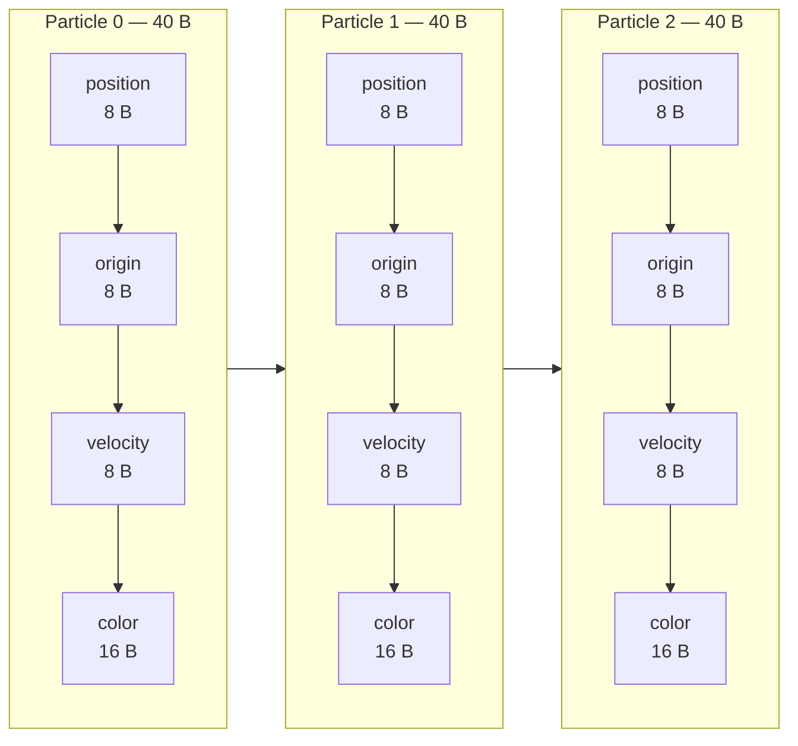
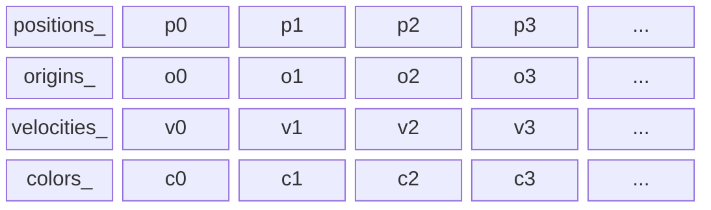
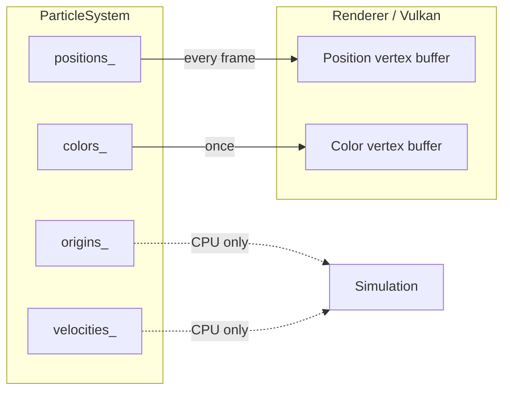
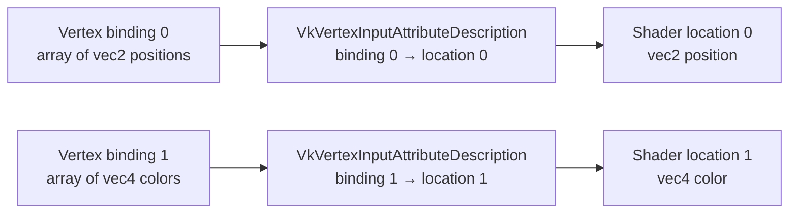
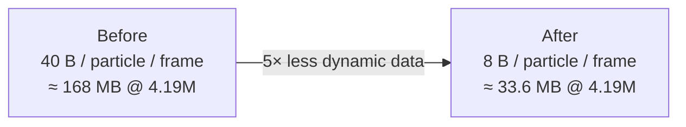
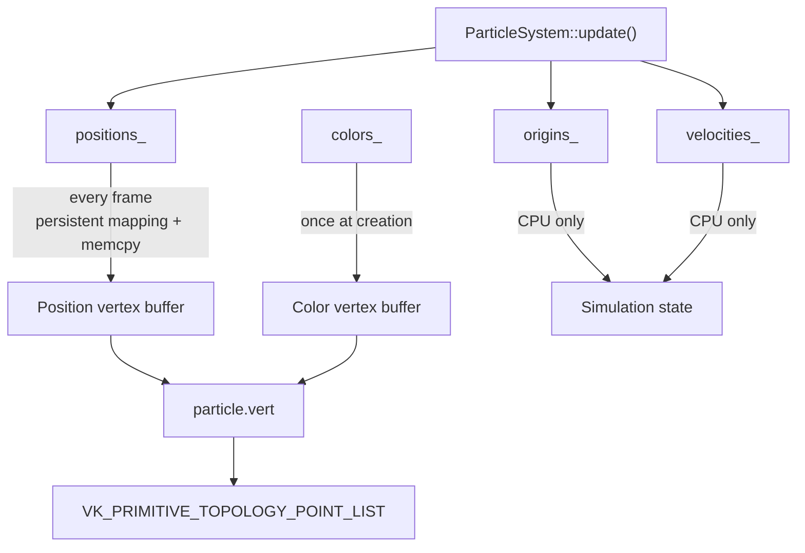

# Particle data layout — CPU simulation and Vulkan vertex streams

This note documents the particle layout introduced after the persistent-mapping baseline.

The goal is not to build a generic ECS or a draw-command system. It is to stop using the CPU simulation layout as an accidental Vulkan vertex format.

---

## 1. The previous layout: one `Particle` struct for everything

The original simulation stored an array of structures:

```cpp
struct Particle {
    glm::vec2 position;
    glm::vec2 origin;
    glm::vec2 velocity;
    glm::vec4 color;
};

std::vector<Particle> particles;
```

This is an **Array of Structures (AoS)**:



It also coupled two different needs:

| CPU simulation needs | Gfx pipeline needs |
|----------------------|--------------------|
| position             | position           |
| origin               | color              |
| velocity             |                    |

`origin` and `velocity` were therefore uploaded every frame even though the vertex shader never reads them. `color` was also uploaded every frame even though it does not currently change during the simulation.

With the current types, the old dynamic upload was nominally:

$$
8 + 8 + 8 + 16 = 40\text{ bytes per particle per frame}
$$

For about four million particles, that is roughly:

$$
4,194,304 \times 40 \approx 168\text{ MB per frame}
$$

---

## 2. The new CPU layout: Structure of Arrays

`ParticleSystem` now owns one contiguous array per property:

```cpp
std::vector<glm::vec2> positions_;
std::vector<glm::vec2> origins_;
std::vector<glm::vec2> velocities_;
std::vector<glm::vec4> colors_;
```

This is a **Structure of Arrays (SoA)** layout:



The particle with logical index `i` is represented by:

```cpp
positions_[i]
origins_[i]
velocities_[i]
colors_[i]
```

The vectors must therefore always keep the same element count. They are private and are populated together by `ParticleSystem`, so callers cannot independently resize one stream.

The simulation loop only touches the streams it needs:

```cpp
glm::vec2& position = positions_[i];
const glm::vec2& origin = origins_[i];
glm::vec2& velocity = velocities_[i];
```

`colors_` is no longer part of the hot simulation data.

This may also improve CPU cache behaviour, but that is a measured consequence, not the reason for the design. The main reason is that the consumers genuinely need different subsets of the data.

---

## 3. The renderer no longer knows the CPU simulation type

`Renderer` no longer accepts a `Particle` object.

At construction it receives the two streams required by the graphics pipeline:

```cpp
std::span<const glm::vec2> particlePositions;
std::span<const glm::vec4> particleColors;
```

During a frame it only receives the dynamic stream:

```cpp
renderer.drawFrame(viewProjection, particleSystem.positions());
```

This removes the accidental dependency on simulation-only state.



The simulation remains owned and orchestrated by `App`; the renderer only sees renderable data.

---

## 4. Two Vulkan vertex buffers

Particles now use two vertex bindings.

### Binding 0 — positions

```text
binding  = 0
stride   = sizeof(glm::vec2)
format   = VK_FORMAT_R32G32_SFLOAT
location = 0
```

The buffer is:

* host visible;
* host coherent;
* persistently mapped;
* rewritten every frame.

### Binding 1 — colors

```text
binding  = 1
stride   = sizeof(glm::vec4)
format   = VK_FORMAT_R32G32B32A32_SFLOAT
location = 1
```

The buffer is uploaded once because colors are currently immutable.

The two buffers are bound together:

```cpp
VkBuffer buffers[] = {
    positionBuffer,
    colorBuffer,
};

vkCmdBindVertexBuffers(...);
```

The existing vertex shader does not need to change:

```glsl
layout(location = 0) in vec2 position;
layout(location = 1) in vec4 color;
```

---

## 5. `binding` and `location` are different concepts

This distinction is important in Vulkan.

A **binding** describes a vertex-buffer stream.

A shader **location** describes a vertex attribute expected by the shader.

`VkVertexInputAttributeDescription` connects the two:



The shader therefore does not care whether its attributes come from one interleaved buffer or several separate buffers. That decision belongs to the vertex-input configuration.

---

## 6. Dynamic traffic after the split

The color buffer is static, so the per-frame host upload contains only positions:

$$
8\text{ bytes per particle per frame}
$$

For about four million particles:

$$
4,194,304 \times 8 \approx 33.6\text{ MB per frame}
$$

Compared with the previous nominal 168 MB per frame:

$$
\frac{40}{8} = 5
$$

so the dynamic copy is five times smaller.



This does **not** imply a guaranteed five-times reduction in frame time. The benchmark must tell us how much of the measured upload cost was actually proportional to copied bytes.

The `particle_upload_ms` metric is intentionally kept unchanged so the new benchmark can be compared directly with the naive and persistent-mapping baselines.

---

## 7. What this change intentionally does not do

The color buffer is still `HOST_VISIBLE | HOST_COHERENT`. We do not yet stage it into a `DEVICE_LOCAL` buffer.

Colors are still `glm::vec4` floats. We do not yet compress them to `VK_FORMAT_R8G8B8A8_UNORM`.

There is still one frame in flight.

The simulation is still CPU-side.

There is no generic `VertexStream`, `ParticleRenderer`, resource manager, allocator, or draw-command abstraction.

Those are separate experiments. Keeping this patch narrow lets the next benchmark answer one useful question:

> What happens when Pixel Storm stops copying simulation-only and static particle data every frame?

---

## 8. Current data flow



The next benchmark should compare the same 500k / 1M / 2M / 4M workloads and focus first on:

* `simulation_ms`, because the CPU layout changed;
* `particle_upload_ms`, because only positions are copied now;
* `frame_wall_ms`, to see whether either improvement affects the complete frame.
